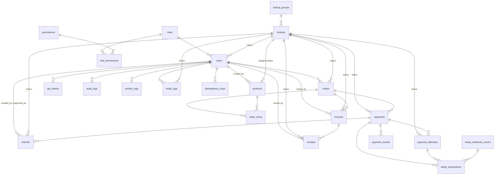

# Database Design — Payment Portal

**CodeIgniter 3 · PHP 7.3 · MySQL 8 · Stripe**

**Related:** [Technology Guide](technology-guide.md) · [Technology Flow Guide](technology-flow-guide.md) · [Installation Guide](installation-guide.md)

---

### Overview

23 tables supporting RBAC, payment processing via Stripe, invoice/receipt generation, API token access, audit logging, and generic lookups.

**Design goals:** 3NF with intentional denormalization for financial snapshots · referential integrity via FKs · payment safety via Stripe event idempotency · immutable financial documents · generic lookup pattern replacing hard-coded enums.

---

### ER Diagram



### Table Reference

| # | Table | Purpose |
|---|-------|---------|
| 1 | `roles` | Named roles (Admin, User) |
| 2 | `permissions` | Permission codes (`product.create`, `invoice.view.all`) |
| 3 | `role_permissions` | Junction: permissions → roles |
| 4 | `users` | Application accounts, soft-deletable |
| 5 | `products` | Catalog items, soft-deletable, versioned |
| 6 | `orders` | Purchase record, versioned |
| 7 | `order_items` | Line items with price snapshots |
| 8 | `payments` | Internal payment records |
| 9 | `payment_attempts` | Retry attempts per payment |
| 10 | `stripe_transactions` | Stripe-level transaction records |
| 11 | `stripe_webhook_events` | Inbound webhook event log + idempotency |
| 12 | `payment_events` | Event history per payment |
| 13 | `idempotency_keys` | API idempotency tracking |
| 14 | `refunds` | Refund tracking (partial/full) |
| 15 | `invoices` | Billing documents |
| 16 | `receipts` | Payment-proof documents |
| 17 | `api_tokens` | Hashed bearer tokens |
| 18 | `audit_logs` | Before/after change tracking |
| 19 | `activity_logs` | User activity trail |
| 20 | `lookup_groups` | Categories of lookup values |
| 21 | `lookups` | Individual lookup values |
| 22 | `settings` | Key/value application config |
| 23 | `email_logs` | Outbound email records |

---

### Column Detail

#### roles

| Column | Type | Constraints |
|--------|------|-------------|
| id | bigint | PK, auto-increment |
| name | varchar(50) | NOT NULL, UNIQUE |
| description | varchar(255) | |
| created_at | datetime | |
| updated_at | datetime | |

#### permissions

| Column | Type | Constraints |
|--------|------|-------------|
| id | bigint | PK, auto-increment |
| code | varchar(100) | NOT NULL, UNIQUE |
| name | varchar(255) | NOT NULL |
| description | text | |
| created_at | datetime | |
| updated_at | datetime | |

#### role_permissions

| Column | Type | Constraints |
|--------|------|-------------|
| id | bigint | PK, auto-increment |
| role_id | bigint | NOT NULL → roles.id |
| permission_id | bigint | NOT NULL → permissions.id |
| created_at | datetime | |

**Index:** `(role_id, permission_id)` UNIQUE

#### users

| Column | Type | Constraints |
|--------|------|-------------|
| id | bigint | PK, auto-increment |
| role_id | bigint | NOT NULL → roles.id |
| name | varchar(150) | NOT NULL |
| email | varchar(150) | NOT NULL, UNIQUE |
| password | varchar(255) | NOT NULL |
| status_lookup_id | bigint | → lookups.id |
| last_login_at | datetime | |
| created_at | datetime | |
| updated_at | datetime | |
| deleted_at | datetime | |

**Indexes:** `role_id`, `status_lookup_id`, `email`

#### products

| Column | Type | Constraints |
|--------|------|-------------|
| id | bigint | PK, auto-increment |
| category_lookup_id | bigint | → lookups.id |
| status_lookup_id | bigint | → lookups.id |
| name | varchar(255) | NOT NULL |
| description | text | |
| sku | varchar(100) | UNIQUE |
| price | decimal(12,2) | NOT NULL |
| stock_qty | int | DEFAULT 0 |
| version | int | DEFAULT 1 |
| created_by | bigint | → users.id |
| created_at | datetime | |
| updated_at | datetime | |
| deleted_at | datetime | |

**Indexes:** `sku`, `category_lookup_id`, `status_lookup_id`, `created_by`

#### orders

| Column | Type | Constraints |
|--------|------|-------------|
| id | bigint | PK, auto-increment |
| user_id | bigint | NOT NULL → users.id |
| order_no | varchar(100) | NOT NULL, UNIQUE |
| status_lookup_id | bigint | → lookups.id |
| total_amount | decimal(12,2) | NOT NULL |
| version | int | DEFAULT 1 |
| created_at | datetime | |
| updated_at | datetime | |

**Indexes:** `order_no`, `user_id`, `status_lookup_id`

#### order_items

| Column | Type | Constraints |
|--------|------|-------------|
| id | bigint | PK, auto-increment |
| order_id | bigint | NOT NULL → orders.id |
| product_id | bigint | NOT NULL → products.id |
| quantity | int | NOT NULL |
| unit_price | decimal(12,2) | NOT NULL |
| subtotal | decimal(12,2) | NOT NULL |
| created_at | datetime | |

**Indexes:** `order_id`, `product_id`

#### payments

| Column | Type | Constraints |
|--------|------|-------------|
| id | bigint | PK, auto-increment |
| order_id | bigint | NOT NULL → orders.id |
| payment_no | varchar(100) | NOT NULL, UNIQUE |
| amount | decimal(12,2) | NOT NULL |
| currency | varchar(10) | NOT NULL, DEFAULT 'USD' |
| payment_method | varchar(50) | |
| status_lookup_id | bigint | → lookups.id |
| version | int | NOT NULL, DEFAULT 1 |
| failure_reason | text | |
| paid_at | datetime | |
| created_at | datetime | |
| updated_at | datetime | |

**Indexes:** `order_id`, `payment_no`, `status_lookup_id`

#### payment_attempts

| Column | Type | Constraints |
|--------|------|-------------|
| id | bigint | PK, auto-increment |
| payment_id | bigint | NOT NULL → payments.id |
| attempt_no | int | NOT NULL |
| provider | varchar(50) | |
| stripe_session_id | varchar(255) | |
| payment_intent_id | varchar(255) | |
| amount | decimal(12,2) | |
| status_lookup_id | bigint | → lookups.id |
| failure_reason | text | |
| created_at | datetime | |
| updated_at | datetime | |

**Index:** `(payment_id, attempt_no)` UNIQUE

#### stripe_transactions

| Column | Type | Constraints |
|--------|------|-------------|
| id | bigint | PK, auto-increment |
| payment_id | bigint | NOT NULL → payments.id |
| payment_attempt_id | bigint | → payment_attempts.id |
| webhook_event_id | bigint | → stripe_webhook_events.id |
| provider | varchar(50) | DEFAULT 'stripe' |
| stripe_session_id | varchar(255) | |
| payment_intent_id | varchar(255) | |
| charge_id | varchar(255) | |
| currency | varchar(10) | |
| amount | decimal(12,2) | |
| provider_status | varchar(50) | |
| raw_payload | text | |
| created_at | datetime | |
| updated_at | datetime | |

**Indexes:** `payment_id`, `payment_attempt_id`, `webhook_event_id`, `payment_intent_id`, `stripe_session_id`, `charge_id`

#### stripe_webhook_events

| Column | Type | Constraints |
|--------|------|-------------|
| id | bigint | PK, auto-increment |
| event_id | varchar(255) | NOT NULL, UNIQUE |
| event_type | varchar(255) | |
| processed | boolean | DEFAULT false |
| retry_count | int | DEFAULT 0 |
| processing_started_at | datetime | |
| processing_completed_at | datetime | |
| error_message | text | |
| payload | text | |
| created_at | datetime | |
| processed_at | datetime | |

**Indexes:** `event_id` UNIQUE, `processed`, `event_type`

#### payment_events

| Column | Type | Constraints |
|--------|------|-------------|
| id | bigint | PK, auto-increment |
| payment_id | bigint | NOT NULL → payments.id |
| event_type | varchar(100) | |
| event_source | varchar(50) | |
| payload | text | |
| created_at | datetime | |

**Indexes:** `payment_id`, `event_type`

#### idempotency_keys

| Column | Type | Constraints |
|--------|------|-------------|
| id | bigint | PK, auto-increment |
| user_id | bigint | → users.id |
| idempotency_key | varchar(255) | NOT NULL, UNIQUE |
| request_hash | varchar(255) | |
| response_data | text | |
| expires_at | datetime | |
| created_at | datetime | |

**Indexes:** `idempotency_key` UNIQUE, `user_id`

#### refunds

| Column | Type | Constraints |
|--------|------|-------------|
| id | bigint | PK, auto-increment |
| payment_id | bigint | NOT NULL → payments.id |
| refund_no | varchar(100) | NOT NULL, UNIQUE |
| stripe_refund_id | varchar(255) | UNIQUE |
| amount | decimal(12,2) | NOT NULL |
| reason | varchar(255) | |
| status_lookup_id | bigint | → lookups.id |
| refunded_at | datetime | |
| created_by | bigint | → users.id |
| approved_by | bigint | → users.id |
| approved_at | datetime | |
| created_at | datetime | |
| updated_at | datetime | |

**Indexes:** `refund_no` UNIQUE, `payment_id`, `stripe_refund_id`, `status_lookup_id`, `created_by`, `approved_by`

#### invoices

| Column | Type | Constraints |
|--------|------|-------------|
| id | bigint | PK, auto-increment |
| order_id | bigint | NOT NULL → orders.id |
| invoice_no | varchar(100) | NOT NULL, UNIQUE |
| amount | decimal(12,2) | NOT NULL |
| status_lookup_id | bigint | → lookups.id |
| issued_at | datetime | |
| issued_by | bigint | → users.id |
| created_at | datetime | |
| updated_at | datetime | |

**Indexes:** `invoice_no` UNIQUE, `order_id` UNIQUE, `status_lookup_id`, `issued_by`

#### receipts

| Column | Type | Constraints |
|--------|------|-------------|
| id | bigint | PK, auto-increment |
| invoice_id | bigint | NOT NULL → invoices.id |
| receipt_no | varchar(100) | NOT NULL, UNIQUE |
| amount | decimal(12,2) | NOT NULL |
| status_lookup_id | bigint | → lookups.id |
| issued_at | datetime | |
| issued_by | bigint | → users.id |
| created_at | datetime | |
| updated_at | datetime | |

**Indexes:** `receipt_no` UNIQUE, `invoice_id` UNIQUE, `status_lookup_id`, `issued_by`

#### api_tokens

| Column | Type | Constraints |
|--------|------|-------------|
| id | bigint | PK, auto-increment |
| user_id | bigint | NOT NULL → users.id |
| token_hash | varchar(255) | |
| expires_at | datetime | |
| last_used_at | datetime | |
| created_at | datetime | |

**Indexes:** `token_hash` UNIQUE, `user_id`

#### audit_logs

| Column | Type | Constraints |
|--------|------|-------------|
| id | bigint | PK, auto-increment |
| user_id | bigint | → users.id |
| action | varchar(100) | |
| entity_type | varchar(100) | |
| entity_id | bigint | |
| old_data | json | |
| new_data | json | |
| ip_address | varchar(100) | |
| user_agent | text | |
| created_at | datetime | |

**Indexes:** `user_id`, `entity_type`, `entity_id`, `action`

#### activity_logs

| Column | Type | Constraints |
|--------|------|-------------|
| id | bigint | PK, auto-increment |
| user_id | bigint | → users.id |
| activity_type | varchar(100) | |
| description | text | |
| ip_address | varchar(100) | |
| created_at | datetime | |

**Indexes:** `user_id`, `activity_type`

#### lookup_groups

| Column | Type | Constraints |
|--------|------|-------------|
| id | bigint | PK, auto-increment |
| code | varchar(100) | NOT NULL, UNIQUE |
| name | varchar(255) | |
| description | text | |
| created_at | datetime | |
| updated_at | datetime | |

#### lookups

| Column | Type | Constraints |
|--------|------|-------------|
| id | bigint | PK, auto-increment |
| group_id | bigint | NOT NULL → lookup_groups.id |
| code | varchar(100) | |
| value | varchar(255) | |
| description | text | |
| sort_order | int | DEFAULT 0 |
| is_active | boolean | DEFAULT true |
| created_at | datetime | |
| updated_at | datetime | |

**Indexes:** `group_id`, `(group_id, code)` UNIQUE

#### settings

| Column | Type | Constraints |
|--------|------|-------------|
| id | bigint | PK, auto-increment |
| setting_key | varchar(255) | NOT NULL, UNIQUE |
| setting_value | text | |
| description | text | |
| created_at | datetime | |
| updated_at | datetime | |

#### email_logs

| Column | Type | Constraints |
|--------|------|-------------|
| id | bigint | PK, auto-increment |
| user_id | bigint | → users.id |
| email_to | varchar(255) | |
| subject | varchar(255) | |
| status_lookup_id | bigint | → lookups.id |
| response | text | |
| sent_at | datetime | |

**Indexes:** `user_id`, `status_lookup_id`

---

### Relationships Summary

| Parent | Child | FK Column(s) |
|--------|-------|-------------|
| `roles` | `users`, `role_permissions` | role_id |
| `permissions` | `role_permissions` | permission_id |
| `users` | `orders`, `products`(created_by), `api_tokens`, `audit_logs`, `activity_logs`, `email_logs`, `idempotency_keys`, `refunds`(created_by/approved_by), `invoices`(issued_by), `receipts`(issued_by) | user_id / created_by / approved_by / issued_by |
| `lookup_groups` | `lookups` | group_id |
| `lookups` | `users`(status), `products`(category/status), `orders`(status), `payments`(status), `payment_attempts`(status), `invoices`(status), `receipts`(status), `refunds`(status), `email_logs`(status) | status_lookup_id / category_lookup_id |
| `orders` | `order_items`, `payments`, `invoices` | order_id |
| `products` | `order_items` | product_id |
| `payments` | `payment_attempts`, `stripe_transactions`, `payment_events`, `refunds` | payment_id |
| `payment_attempts` | `stripe_transactions` | payment_attempt_id |
| `stripe_webhook_events` | `stripe_transactions` | webhook_event_id |
| `invoices` | `receipts` | invoice_id |

---

### Design Decisions

| Decision | Rationale |
|----------|-----------|
| **Version columns** | `products.version` and `orders.version` enable optimistic locking for concurrent updates |
| **Payment attempts** | `payment_attempts` tracks each retry separately — preserves history of failed attempts before success |
| **Payment events** | `payment_events` captures a chronological event stream per payment (created, attempted, succeeded, failed, refunded) |
| **Idempotency keys** | `idempotency_keys` table provides API-level idempotency — clients can retry safely |
| **Webhook idempotency** | `stripe_webhook_events.event_id` UNIQUE — rejects duplicate Stripe deliveries at DB level |
| **Lookup pattern** | `lookup_groups` + `lookups` replaces hard-coded enums — new statuses are data, not migrations |
| **Separate logs** | `audit_logs` (compliance, old/new data) vs `activity_logs` (high-volume routine actions) |
| **Soft deletes** | `deleted_at` on users/products preserves historical orders |
| **Price snapshots** | `order_items.unit_price` copied at purchase time — historical invoices stay accurate |
| **Receipts → invoices** | Receipt references invoice (not order directly) — matches billing → proof-of-payment sequence |
| **Relational RBAC** | `roles` + `permissions` + `role_permissions` — data-driven auth, not hard-coded role checks |

---

### Suggested Indexes

| Index | Use case |
|-------|----------|
| `role_permissions(role_id, permission_id)` UNIQUE | Junction uniqueness |
| `users.email` | Login lookup |
| `users.role_id`, `users.status_lookup_id` | User filtering |
| `products.sku` | Product lookup |
| `products.category_lookup_id`, `status_lookup_id` | Catalog filtering |
| `orders.order_no` | Order lookup |
| `orders.user_id`, `orders.status_lookup_id` | User order listing + filtering |
| `order_items.order_id`, `product_id` | Order line items |
| `payments.payment_no` | Payment lookup |
| `payments.order_id`, `status_lookup_id` | Payment listing |
| `payment_attempts(payment_id, attempt_no)` UNIQUE | Attempt dedup |
| `stripe_transactions.payment_intent_id`, `stripe_session_id`, `charge_id` | Stripe reconciliation |
| `stripe_webhook_events.event_id` UNIQUE | Webhook idempotency |
| `payment_events.payment_id` | Payment event history |
| `idempotency_keys.idempotency_key` UNIQUE | API idempotency |
| `refunds.payment_id`, `stripe_refund_id` | Refund tracking |
| `invoices.invoice_no` UNIQUE, `order_id` UNIQUE | Invoice lookup |
| `receipts.receipt_no` UNIQUE, `invoice_id` UNIQUE | Receipt lookup |
| `api_tokens.token_hash` UNIQUE | Bearer token auth |
| `audit_logs(entity_type, entity_id)` | Entity history queries |
| `activity_logs.user_id` | User activity trail |
| `lookups(group_id, code)` UNIQUE | Lookup resolution |
| `email_logs.user_id`, `status_lookup_id` | Email history |

---

### Data Flow

```
Order placed
  → orders (pending)
  → order_items (price snapshots)

Checkout initiated
  → payments (pending, payment_no)
  → payment_attempts (attempt_no = 1, stripe_session_id)

Stripe webhook received
  → stripe_webhook_events (event_id, deduplicated)
  → stripe_transactions (provider_status)
  → payment_events (event_type = 'payment.completed')
  → payments (paid, paid_at)
  → orders (paid)

On successful payment
  → invoices (immutable billing document)
  → receipts (proof-of-payment against invoice)

Refund (optional)
  → refunds (refund_no, stripe_refund_id)
  → payment_events (event_type = 'refund.completed')
  → payments (status = refunded / partially_refunded)
```

---

### Migration Files

| # | Migration | Tables created |
|---|-----------|---------------|
| 001 | `create_roles` | roles |
| 002 | `create_permissions` | permissions |
| 003 | `create_role_permissions` | role_permissions |
| 004 | `create_users` | users |
| 005 | `create_products` | products |
| 006 | `create_lookup_groups` | lookup_groups |
| 007 | `create_lookups` | lookups |
| 008 | `create_orders` | orders |
| 009 | `create_order_items` | order_items |
| 010 | `create_payments` | payments |
| 011 | `create_payment_attempts` | payment_attempts |
| 012 | `create_stripe_webhook_events` | stripe_webhook_events |
| 013 | `create_stripe_transactions` | stripe_transactions |
| 014 | `create_payment_events` | payment_events |
| 015 | `create_idempotency_keys` | idempotency_keys |
| 016 | `create_refunds` | refunds |
| 017 | `create_invoices` | invoices |
| 018 | `create_receipts` | receipts |
| 019 | `create_api_tokens` | api_tokens |
| 020 | `create_audit_logs` | audit_logs |
| 021 | `create_activity_logs` | activity_logs |
| 022 | `create_settings` | settings |
| 023 | `create_email_logs` | email_logs |
| 024 | `seed_roles` | Insert admin + user roles |
| 025 | `seed_permissions` | Insert default permissions |
| 026 | `seed_lookups` | Insert status/category lookups |

---

### SQL Companion Files

| File | Purpose |
|------|---------|
| `sql/schema.sql` | Full DDL |
| `sql/seed.sql` | Initial seed data (roles, permissions, lookups, admin user, demo products) |
| `sql/rollback.sql` | Drop all tables in dependency-safe order |
