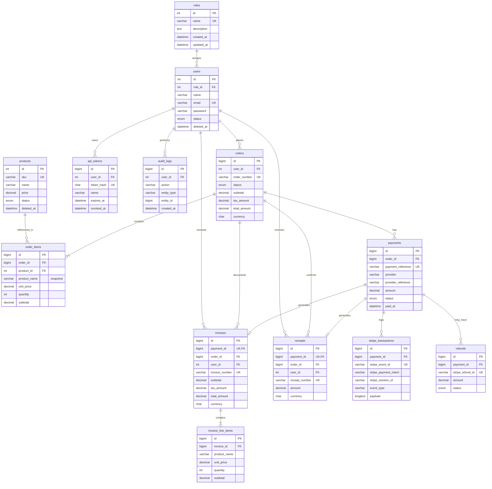

# Database Design — Payment Portal

## Overview

This schema supports a CodeIgniter 3 payment portal with admin product/user management, customer purchases via Stripe, invoice/receipt generation, API token access, and audit logging.

Design goals:

- **3NF** with intentional denormalization for financial snapshots
- **Referential integrity** via foreign keys with deliberate `ON DELETE` rules
- **Payment safety** via Stripe event idempotency and immutable financial documents
- **Clarity** — straightforward constraints suitable for a take-home assessment

---

## ER Diagram



---

## Table Summary

| Table | Purpose |
|---|---|
| `roles` | Permission groups (`admin`, `customer`) |
| `users` | Authenticated portal users with soft delete |
| `products` | Purchasable catalog items |
| `orders` | Purchase header with totals and status |
| `order_items` | Line items with price snapshots |
| `payments` | Internal payment records with provider identifiers |
| `stripe_transactions` | Immutable Stripe webhook/event log |
| `invoices` | Formal billing document per successful payment |
| `invoice_line_items` | Snapshotted line items on the invoice |
| `receipts` | Payment confirmation document per successful payment |
| `refunds` | Refund attempts linked to Stripe |
| `api_tokens` | Hashed bearer tokens for API access |
| `audit_logs` | Who did what, to which entity, and when |

---

## Key Design Decisions

### 1. User email uniqueness

`users.email` has a straightforward `UNIQUE` constraint. Soft-deleted users retain their email in the row, so the same address cannot be re-registered without handling that in application logic (e.g. clearing or mutating the email on delete).

### 2. Payment identifier separation

The `payments` table distinguishes internal and external identifiers:

| Column | Example | Purpose |
|---|---|---|
| `payment_reference` | `PAY-20260708-000001` | Application-owned immutable reference shown to users |
| `provider` | `stripe` | Payment provider name |
| `provider_reference` | `pi_3abc123` | Provider-owned identifier (e.g. Stripe Payment Intent) |

`UNIQUE(payment_reference)` and `UNIQUE(provider, provider_reference)` allow future providers without schema changes. `provider_reference` is nullable until the provider assigns an ID.

### 3. Financial snapshots

`order_items.product_name`, `unit_price`, and `subtotal` are copied at purchase time so historical orders remain accurate even if products change or are soft-deleted.

`invoice_line_items` mirrors this pattern for issued invoices — invoices are **immutable documents** once created.

### 4. Payment domain separation

| Layer | Table | Responsibility |
|---|---|---|
| Business | `payments` | Internal payment state and identifiers |
| Provider | `stripe_transactions` | Raw Stripe events, one row per webhook |
| Documents | `invoices`, `receipts` | Customer-facing records |
| Reversals | `refunds` | Partial or full refund tracking |

`stripe_transactions.stripe_event_id` is **UNIQUE** to guarantee webhook idempotency — duplicate Stripe deliveries are rejected at the database level.

### 5. One invoice and one receipt per payment

`UNIQUE(payment_id)` on both `invoices` and `receipts` prevents duplicate document generation from race conditions or double webhook processing.

`user_id` and `order_id` are denormalized onto invoices/receipts to simplify user-scoped queries without multi-table joins.

### 6. Audit log scope

`audit_logs` records **who** (`user_id`), **what** (`action`), **which entity** (`entity_type`, `entity_id`), and **when** (`created_at`), plus optional `ip_address` and `user_agent`. It does not store before/after value diffs.

### 7. Foreign key delete rules

| Relationship | ON DELETE | Rationale |
|---|---|---|
| `order_items` → `orders` | CASCADE | Line items have no meaning without the order |
| `order_items` → `products` | RESTRICT | Preserve order history |
| `payments` → `orders` | RESTRICT | Never orphan payments |
| `stripe_transactions` → `payments` | RESTRICT | Preserve financial audit trail |
| `invoices/receipts` → `payments` | RESTRICT | Documents must not outlive payments |
| `api_tokens` → `users` | CASCADE | Tokens are user-scoped credentials |
| `audit_logs` → `users` | SET NULL | Retain logs after user deletion |

### 8. API token storage

Only `token_hash` (SHA-256, 64 hex chars) is stored. The raw bearer token is shown once at creation and never persisted.

### 9. BIGINT on high-volume tables

`orders`, `order_items`, `payments`, `stripe_transactions`, `invoices`, `receipts`, `refunds`, `api_tokens`, and `audit_logs` use `BIGINT UNSIGNED` primary keys.

### 10. CHECK constraints

MySQL 8 `CHECK` constraints enforce:

- `price`, `amount`, `subtotal` ≥ 0
- `quantity` > 0
- `refund.amount` > 0

### 11. Indexes

Beyond primary and foreign key indexes:

| Index | Use case |
|---|---|
| `orders.created_at` | Admin order listing, date filters |
| `payments.paid_at` | Revenue reporting |
| `payments.provider_reference` | Provider reconciliation |
| `stripe_transactions.stripe_payment_intent` | Checkout reconciliation |
| `stripe_transactions.stripe_session_id` | Success/cancel redirect lookup |
| `invoices.user_id`, `receipts.user_id` | User document listing |
| `audit_logs.(entity_type, entity_id)` | Entity history |
| `audit_logs.created_at` | Time-range queries |
| `api_tokens.expires_at` | Token cleanup jobs |
| `users.(status, deleted_at)` | Active user queries |

---

## Data Flow

```
User places order
    → orders (pending)
    → order_items (snapshotted prices)

Checkout initiated
    → payments (pending, payment_reference, provider = stripe)
    → payments.provider_reference set when Stripe returns Payment Intent ID

Stripe webhook received
    → stripe_transactions (stripe_event_id UNIQUE — idempotent)
    → payments (paid, paid_at)
    → orders (paid)

On successful payment
    → invoices + invoice_line_items (snapshotted)
    → receipts

Refund (optional)
    → refunds (stripe_refund_id UNIQUE)
    → payments (refunded / partially_refunded)
    → orders (refunded)
```

---

## Migration Files

| # | File | Action |
|---|---|---|
| 001 | `create_roles` | Roles table |
| 002 | `create_users` | Users with unique email |
| 003 | `create_products` | Products with SKU |
| 004 | `create_orders` | Orders with tax/currency |
| 005 | `create_order_items` | Line items with snapshots |
| 006 | `create_payments` | Payment records with provider identifiers |
| 007 | `create_stripe_transactions` | Stripe event log |
| 008 | `create_invoices` | Invoice headers |
| 009 | `create_receipts` | Receipt records |
| 010 | `create_api_tokens` | Hashed API tokens |
| 011 | `create_audit_logs` | Audit trail |
| 012 | `create_invoice_line_items` | Invoice line snapshots |
| 013 | `create_refunds` | Refund tracking |
| 014 | `seed_roles` | Insert `admin` and `customer` roles |

---

## SQL Companion Files

| File | Purpose |
|---|---|
| `sql/schema.sql` | Full DDL — use for manual setup or reference |
| `sql/seed.sql` | Default role seed data |
| `sql/rollback.sql` | Drop all tables in dependency-safe order |
